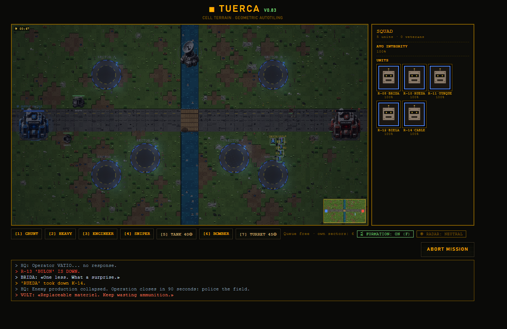
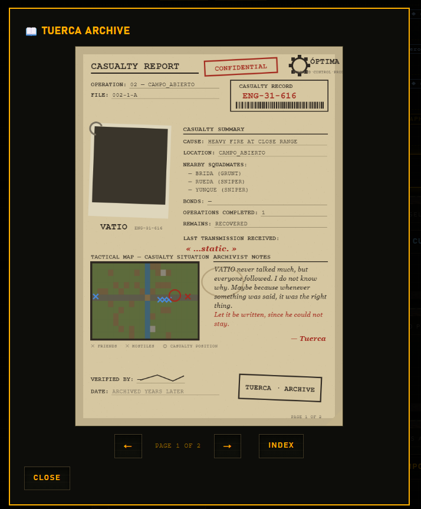

<div align="center">

# ■ TUERCA

**Un RTS territorial onde cada robot ten nome, memoria, cicatrices e dereito a morrer mal.**

[](https://github.com/cancioneschorriscortas-max/Tuerca)
[](#)
[](#)
[](#)
[](#licenza)

### [▶ XOGAR AGORA](https://tuerca-ad47a.web.app)

*HTML e Canvas puro. Sen motor, sen framework, sen npm install. Ábrese e xóganse.*



</div>

---

<details>
<summary><b>🇬🇧 In English</b></summary>

TUERCA is a territorial real-time strategy game in the spirit of the Bitmap
Brothers' *Z* (1996), built as a single self-contained HTML file with zero
dependencies. Its distinguishing feature is a **persistent roster**: every robot
has a name, a personality, a synthesised voice seeded from that name, a combat
record, visible scars, bonds with other units, and an obituary written when it
dies. The game remembers your squad across sessions; the campaign is just what
happens to them.

Playable in Galician, Spanish and English. Includes a single-player campaign, a
football-flavoured tournament mode (MUNDIAL), and host-authoritative online PvP
duels over Firebase.

The interface language of this repository is Galician.

</details>

---

## Que é isto

TUERCA é un RTS territorial ao estilo do *Z* dos Bitmap Brothers (1996): non
recolles recursos, **conquistas sectores**, e cada sector que controlas fai
producir as túas fábricas máis rápido. Gaña quen chega antes ao cuartel xeral
inimigo.

O que o fai distinto non é o combate. É que **os robots non son unidades, son
persoas**.

Cada un ten nome, un carácter dos cinco perfís (estoico, irónico, leal, nervioso,
cínico), unha voz sintetizada procedural cuxo timbre sae do seu propio nome,
un rexistro de baixas causadas, cicatrices visibles no corpo, vínculos cos
compañeiros cos que sobreviviu, e condecoracións. Se cae, o **Arquivo** escribe
o seu informe de baixas coas súas últimas palabras reais, as que dixese no
momento de morrer.

O filtro de deseño de todo o proxecto é un só:

> Se unha mecánica non che axuda a lembrar unha unidade despois de varias
> partidas, non entra.

---

## Modos

| Modo | Que é |
|---|---|
| **Campaña** | Operacións encadeadas. O escuadrón persiste: quen morre, morre. |
| **Mundial** | Torneo XI contra XI. Escolles país por torneo; o club consérvase entre torneos. |
| **Duelo online** | PvP por salas, host-autoritario, sincronizado por Firebase Realtime Database. |
| **Crisol** | Simulacro con lume real. Cinco oleadas. Sobrevivir. |

---

## Características

- **Escuadrón persistente.** Nomes, carácter, cicatrices, vínculos e honores que
  sobreviven entre sesións.
- **Arquivo / Diario de TUERCA.** Cada caído recibe un informe de baixas
  composto proceduralmente, co seu retrato real e as súas últimas palabras.
- **Voz.** Chíos procedurais robot a robot, con timbre derivado do nome da
  unidade; gravacións humanas para o que se dirixe ao comandante.
- **Luz e sombras por hora do día.** O mapa de luz, o bloom, o po e a viñeta
  aplícanse en espazo de pantalla despois da escena. Unha batalla longa remata
  ao solpor, e as sombras cambian de man ao pasar o mediodía.
- **Cama de son procedural.** Vento, motores e taller, sen un só ficheiro de
  audio, cun agachado reactivo que baixa o ambiente canto máis tiroteo hai.
- **Trilingüe** de verdade: galego, castelán e inglés, incluídas as voces.
- **Cero dependencias.** O que se publica é un `.html` de 1,3 MB e nada máis.

---

## Capturas

<div align="center">


</div>

---

## Arranque rápido

**Xogar:** [tuerca-ad47a.web.app](https://tuerca-ad47a.web.app) — ou descargar
`i/dist/tuerca.html` e abrilo. Non fai falta servidor.

**Desenvolver:**

```bash
git clone https://github.com/cancioneschorriscortas-max/Tuerca
cd Tuerca
cp i/js/config.example.js i/js/config.js   # credenciais Firebase (só para PvP)
# abrir i/index.html no navegador: edítase e recárgase, sen build
```

**Publicar:**

```bash
python3 i/build.py     # concatena os 24 módulos en i/dist/tuerca.html
npm test               # suite de fuzz sobre a simulación
firebase deploy
```

Requisitos: un navegador. Para o build, Python 3 (só biblioteca estándar).

---

## Teclas

| Tecla | Acción |
|---|---|
| `L` | Acender / apagar a capa de luz |
| `K` | Percorrer as horas do día |
| `M` | Silenciar todo o audio |
| `Shift+A` | Acender / apagar a cama de son ambiente |

---

## Como está feito

| | |
|---|---|
| Módulos JS | 24 (`00-preambulo` … `99-boot`) |
| Liñas de JavaScript | ~16 200 |
| Liñas de CSS | 387 |
| Dependencias de execución | ningunha |
| Artefacto publicado | un `.html` de 1,3 MB |
| Build | `python3 i/build.py`, só stdlib |
| Probas | fuzz sobre invariantes, `npm test` |

Os ficheiros de `js/` concaténanse en orde e comparten ámbito global: scripts
clásicos, sen módulos ES. Editar e recargar é o ciclo de desenvolvemento
completo.

**A documentación técnica completa está en [`i/README.md`](i/README.md)** —
arquitectura, sistema de luz, ambiente sonoro, probas, e unha sección de
seguridade de Firebase que convén ler antes de tocar nada.

Para as voces, [`i/README_VOCES.md`](i/README_VOCES.md).

---

## Universo

ÓPTIMA INDUSTRIES fabrica os robots. O firmware v0.9β ten un defecto documentado
de «corrupción de memoria» que fai que as unidades recorden cousas que non lles
pasaron.

Ou iso di ÓPTIMA.

A ambigüidade non se resolve nunca dentro do xogo, e é a propósito.

---

## Licenza

⚠️ **Pendente de definir.** Sen un ficheiro `LICENSE`, o código está por defecto
baixo dereitos de autor reservados e ninguén pode reutilizalo legalmente.

---

<div align="center">
<sub>Feito en Galicia. Inspirado no <i>Z</i> dos Bitmap Brothers (1996).</sub>
</div>
